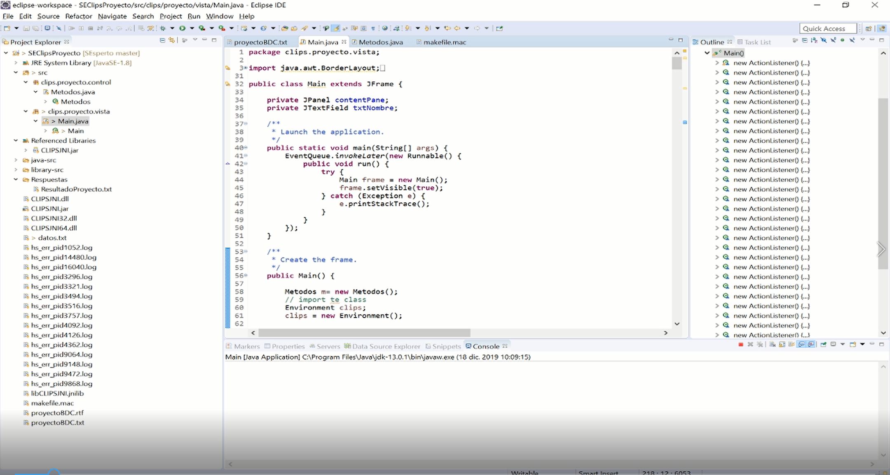

## Integration of Java and clips using JNI.

In the following code we have the integration of Java and clips using JNI.

For this we will need to download and install the following programs that are necessary for the project:

[Eclipse](https://www.eclipse.org/downloads/)
[Java SE Development Kit 8](https://www.oracle.com/technetwork/java/javase/downloads/jdk8-downloads-2133151.html)

Next, we proceed to download JNI Clips and unzip it:

[JNI 6.31 clips](https://sourceforge.net/projects/clipsrules/files/CLIPS/6.31/)

The program that we will carry out is a program to determine if a person is independent or influential.

## Tutorial

